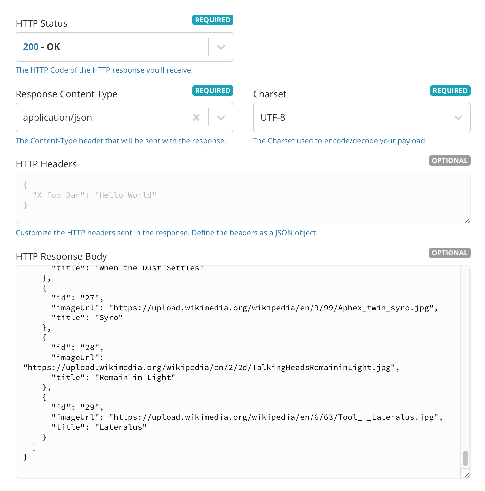

# MusicBrowser 🎶

## Authors

* Patryk Kaczmarek
	* [Github](https://github.com/PatrykKaczmarek)
	* [LinkedIn](https://www.linkedin.com/in/patryk-kaczmarek-ios/)

## Tools & Services

* Tools:
  * [Xcode 14.3](https://developer.apple.com/download/) with latest iOS SDK

## Project Setup

### Instalation

1. Clone repository:

  ```bash
  # over https:
  https://github.com/PatrykKaczmarek/MusicBrowser.git
  # or over SSH:
  git@github.com:PatrykKaczmarek/MusicBrowser.git
  ```

2. Open `MusicBrowser.xcodeproj` file and build the project.

## Coding guidelines

- Respect Swift [API Design Guidelines](https://swift.org/documentation/api-design-guidelines/)
- The code must be readable and self-explanatory - full variable names, meaningful methods, etc.
- Don't leave any commented-out code.

## About the project

The application isn't rocket science, and that's intentional. It has been created with an assumption that there is still some part of code using Objective-C. This implementation is encapsulated, so it doesn't leak outside to the newer parts of the app. 

**Requirements**:

- Implementation consists of two languages: `Objective-C` and `Swift`. This is intentional to show interoperability.
- UI is written mainly in `UIKit` with a small usage of `SwiftUI`.
- The application allows the user to add albums to favorites and store this information persistently on the device.
- User Interface design:
	- is pretty simple.
	- playlists should scroll vertically.
	- albums added to a playlist should scroll horizontally.
- API:
	- contains some minor issues. The app handles them gracefully. 

## Credentials

### API

- [Mocky](https://designer.mocky.io)

## FAQ

#### I see "Oh no! This is embarrassing..." error. What's next?
This error comes from an API layer. It means that a mocked response on [Mocky](https://designer.mocky.io) has expired and had been deleted. To fix this issue, please do following steps:

1. Open [response.json](response.json) - it's located in this repository
2. Open [Mocky](https://designer.mocky.io)
3. Click on `New Mock`
4. Copy the content of [response.json](response.json) file into the `HTTP Response Body`, like this:

	

5. Click on `GENERATE MY HTTP RESPONSE`
6. Copy request's path (<span style="color:red"><u>red underlined</u></span>) and replace the value in [PlaylistRequest.path](MusicBrowser/Modules/Playlist/Service/API/PlaylistRequest.swift) computed variable

	

7. Re-run the app